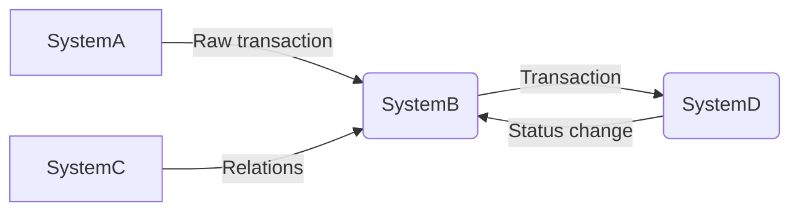

<!-- prettier-ignore-start -->
# Code
{: .no_toc }
<!-- prettier-ignore-end -->

<!-- prettier-ignore-start -->
## Table of contents
{: .no_toc .text-delta }
<!-- prettier-ignore-end -->

<!-- prettier-ignore-start -->

1. TOC
{:toc}
<!-- prettier-ignore-end -->

---

## Inline code

Code can be rendered inline by wrapping it in single back ticks.

<div class="code-example" markdown="1">
Lorem ipsum dolor sit amet, `<inline code snippet>` adipisicing elit, sed do eiusmod tempor incididunt ut labore et dolore magna aliqua.

## Heading with `<inline code snippet>` in it.

{: .no_toc }

</div>
```markdown
Lorem ipsum dolor sit amet, `<inline code snippet>` adipisicing elit, sed do eiusmod tempor incididunt ut labore et dolore magna aliqua.

## Heading with `<inline code snippet>` in it.

````

---

## Syntax highlighted code blocks

Use Jekyll's built-in syntax highlighting with Rouge for code blocks by using three backticks, followed by the language name:

<div class="code-example" markdown="1">
```js
// Javascript code with syntax highlighting.
var fun = function lang(l) {
  dateformat.i18n = require('./lang/' + l)
  return true;
}
````

</div>

```js
// Javascript code with syntax highlighting.
var fun = function lang(l) {
  dateformat.i18n = require('./lang/' + l)
  return true;
}
```


---

## Code blocks with rendered examples

To demonstrate front end code, sometimes it's useful to show a rendered example of that code. After including the styles from your project that you'll need to show the rendering, you can use a `<div>` with the `code-example` class, followed by the code block syntax. If you want to render your output with Markdown instead of HTML, use the `markdown="1"` attribute to tell Jekyll that the code you are rendering will be in Markdown format... This is about to get meta...

<div class="code-example" markdown="1">

<div class="code-example" markdown="1">

[Link button](http://example.com/){: .btn }

</div>
```markdown
[Link button](http://example.com/){: .btn }
```

</div>

<div class="code-example" markdown="1">

[Link button](http://example.com/){: .btn }

</div>
```markdown
[Link button](http://example.com/){: .btn }
```


<link href="https://cdnjs.cloudflare.com/ajax/libs/mermaid/6.0.0/mermaid.css" rel="stylesheet" />
<script src="https://cdnjs.cloudflare.com/ajax/libs/mermaid/6.0.0/mermaid.js"></script>


<div class="mermaid" style="margin:auto;">
            graph TD 
              st{HI!}
              eco{D$$}
              good((Great))
              bad((Mizzz))
              en>Goodbye!]
                en>Goodbye!]
              A((HI))
              style st fill:blue,fill-opacity:0.35,color:#FFFFFF,stroke-opacity:0.2
              style en fill:red,fill-opacity:0.35,color:#FFFFFF,stroke-opacity:0.2
              classDef eco fill:green;
              class A eco
</div>


'''mermaid
graph LR
    A[SystemA] -->|Raw transaction| B(SystemB)
    C[SystemC] -->|Relations| B
    B -->|Transaction| D(SystemD)
    D -->|Status change| B
'''


