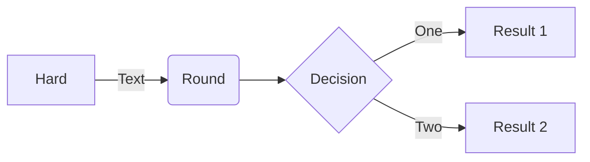

<!-- prettier-ignore-start -->
# Diagrams
{: .no_toc }
<!-- prettier-ignore-end -->

<!-- prettier-ignore-start -->
## Table of contents
{: .no_toc .text-delta }
<!-- prettier-ignore-end -->

<!-- prettier-ignore-start -->

1. TOC
{:toc}
<!-- prettier-ignore-end -->

---

## Mermaid

[Mermaid](https://mermaid-js.github.io/mermaid/#/) lets you create diagrams and visualizations using text and code.

It is a Javascript based diagramming and charting tool that renders Markdown-inspired text definitions to create and modify diagrams dynamically.

## How to

